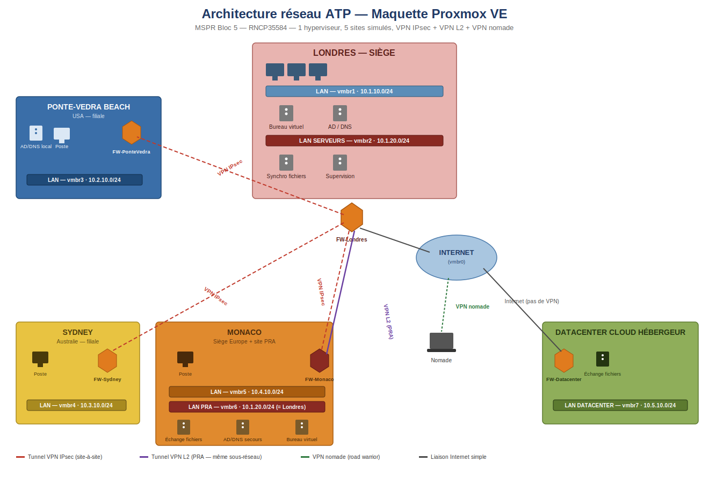

# Infrastructure Cloud & Virtualisée — Projet ATP (MSPR Bloc 5)

> Projet réalisé dans le cadre de la certification **Expert en Informatique et Systèmes d'Information (RNCP35584)** — EPSI, Bloc 5 : *Concevoir et sécuriser des solutions d'infrastructures virtualisées et cloud*.
>
> Cas fictif : l'**Association of Tennis Professionals (ATP)**, présente sur 4 sites (Londres, Ponte-Vedra Beach, Sydney, Monaco) + un hébergeur cloud, souhaite unifier son système d'information, sécuriser ses accès nomades et mettre en place un plan de reprise d'activité.


---

## Sommaire

- [Contexte du projet](#contexte-du-projet)
- [Architecture cible](#architecture-cible)
- [Équipe](#équipe)
- [Structure du dépôt](#structure-du-dépôt)
- [Suivi des missions](#suivi-des-missions)
- [Stack technique](#stack-technique)
- [Reproduire la maquette](#reproduire-la-maquette)
- [Livrables écrits](#livrables-écrits)

---

## Contexte du projet

L'ATP dispose de 4 sites dans le monde (Londres — siège, Ponte-Vedra Beach — USA, Sydney — Australie, Monaco — Europe) fonctionnant aujourd'hui en silos, avec des outils et des méthodes propres à chaque entité. Le nouveau bureau exécutif souhaite :

1. **Uniformiser** le système d'information au siège (identité, bureaux virtuels, partage de fichiers).
2. **Sécuriser** les interconnexions entre sites et les accès des collaborateurs nomades (juges-arbitres, superviseurs en déplacement permanent sur les tournois).
3. Mettre en place un **PCA/PRA** garantissant un RPO ≤ 36h et un RTO ≤ 48h en cas d'incident majeur sur le siège.
4. Préparer, à moyen terme (2 à 5 ans), la **migration vers le cloud** de l'essentiel des applications.

L'ensemble de la maquette est virtualisé sur un unique hyperviseur **Proxmox VE**, chaque site étant simulé par un réseau isolé derrière un firewall dédié.

## Architecture cible



Le détail du plan d'adressage et des choix de conception se trouve dans [`docs/architecture/`](docs/architecture/).

## Équipe

| Membre | Rôle principal sur le projet |
|---|---|
| [Nom Étudiant A] | Infrastructure virtuelle Proxmox, plateforme cloud de fichiers, PRA |
| [Nom Étudiant B] | Firewalls, VPN IPsec/L2/nomade |
| [Nom Étudiant C] | Active Directory, DNS, bureau à distance, supervision |
| [Nom Étudiant D] | Veille, conseil, R&D (choix cloud, UCaaS, SSO, gestion de crise) |

## Structure du dépôt

```
proxmox-atp-mspr/
├── docs/
│   ├── architecture/       → schémas réseau, plan d'adressage, choix de conception (T1)
│   ├── planning/           → planning prévisionnel de l'équipe
│   ├── pra/                → tableau des risques + procédure de déclenchement PRA (C4)
│   └── conseil/            → livrables C1, C2, C3 (choix cloud, UCaaS, SSO)
├── infra/
│   ├── proxmox/            → config des bridges / VLANs (T1)
│   ├── firewall-vpn/
│   │   ├── ipsec-sites/    → tunnels IPsec inter-sites (T4)
│   │   ├── vpn-nomade/     → VPN road warrior (T5)
│   │   └── vpn-l2-pra/     → tunnel VPN L2 Londres ↔ Monaco (T7)
│   ├── active-directory/   → AD/DNS + bureau à distance (T2)
│   ├── bureau-virtuel/     → configuration RDS/RDP (T2)
│   ├── cloud-fichiers/     → plateforme de partage de fichiers (T3)
│   ├── supervision/        → outils de supervision et alerting (T6)
│   └── pra/                → serveurs de secours, procédure de bascule (T7)
├── screenshots/            → captures d'écran des démonstrations
└── README.md
```

## Suivi des missions

### Partie technique

| Mission | Description | Statut |
|---|---|---|
| **T1** | Infrastructure virtuelle Proxmox + VLANs par site | 🟡 En cours |
| **T2** | Identité unifiée (AD/DNS) + bureau à distance | 🟡 En cours |
| **T3** | Plateforme cloud de partage de fichiers | ⚪ À faire |
| **T4** | Firewalls + VPN IPsec inter-sites | ⚪ À faire |
| **T5** | Interconnexion des utilisateurs nomades | ⚪ À faire |
| **T6** | Supervision et alerting | ⚪ À faire |
| **T7** | PRA (serveurs de secours, VPN L2, RPO 36h/RTO 48h) | ⚪ À faire |

### Partie conseil, veille et R&D

| Mission | Description | Statut |
|---|---|---|
| **C1** | Choix du fournisseur cloud + procédure de migration (CAPEX/OPEX) | ⚪ À faire |
| **C2** | Choix d'une solution de communications unifiées (UCaaS) | ⚪ À faire |
| **C3** | Étude de faisabilité SSO / Azure AD | ⚪ À faire |
| **C4** | Procédure de gestion d'incident critique + déclenchement PRA | ⚪ À faire |

> Légende : ⚪ à faire · 🟡 en cours · 🟢 terminé et démontré

## Stack technique

| Composant | Outil retenu | Mission |
|---|---|---|
| Hyperviseur | Proxmox VE | T1 |
| Firewall / VPN | OPNsense (IPsec, OpenVPN) | T4, T5, T7 |
| Annuaire | Samba4 AD DC / Windows Server AD DS | T2 |
| Bureau à distance | RDP / xrdp | T2 |
| Partage de fichiers cloud | Nextcloud | T3 |
| Supervision | Zabbix | T6 |

*(à ajuster selon vos choix définitifs — cette section doit refléter les outils réellement installés)*

## Reproduire la maquette

Prérequis : un serveur avec Proxmox VE installé, accès Internet, ~32 Go de RAM disponibles pour l'ensemble des VM.

1. Importer la configuration réseau : voir [`infra/proxmox/`](infra/proxmox/)
2. Déployer les firewalls de chaque site : voir [`infra/firewall-vpn/`](infra/firewall-vpn/)
3. Déployer les services par site (AD, fichiers, supervision) : voir les sous-dossiers correspondants de `infra/`
4. Suivre la procédure de test décrite dans chaque sous-dossier pour valider chaque mission

Le détail pas-à-pas est disponible dans [`docs/architecture/procedure-installation.md`](docs/architecture/procedure-installation.md).

## Livrables écrits

Le dossier de synthèse complet (documents C1 à C4 + tableau des risques + procédure PRA) est disponible dans [`docs/conseil/`](docs/conseil/) et [`docs/pra/`](docs/pra/).

---

*Projet pédagogique — EPSI, l'école d'ingénierie informatique. Entreprise, prénoms et données fictifs.*
